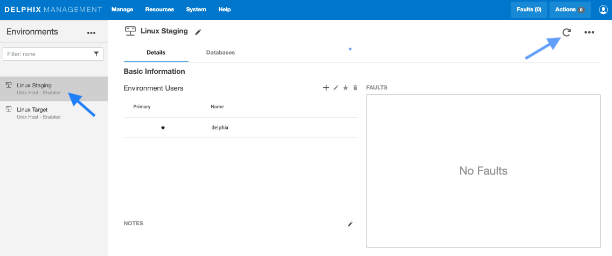
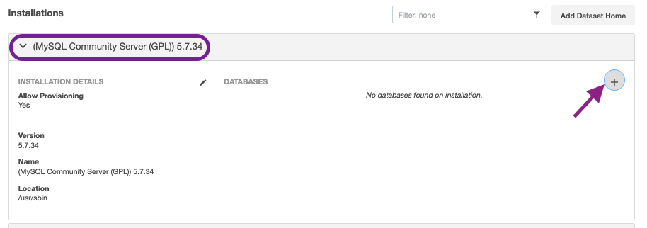
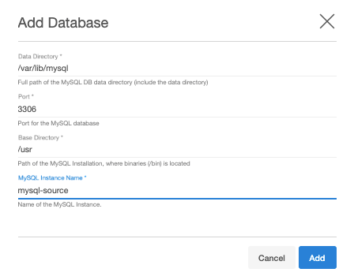

# Discovery

Environment discovery/refresh is a process that enables the MySQL Plugin to determine MySQL installation details on a host. 
Database discovery/refresh is initiated during the environment set up process.

Whenever there is any change (installing a new database home) to an already set up environment in the Delphix application, 
we need to perform an environment discovery/refresh.

## Prerequisites

-   Installation of the MySQL Plugin is required before the Discovery.

## Refreshing an Environment

Environment refresh will update the metadata associated with that environment and push Delphix Toolkit on to the host.

1. Login to the **Delphix Management** application.
2. Click **Manage**.
3. Select **Environments**.
4. In the Environments panel, click the name of the environment you want to refresh.
5. Select the **Refresh** icon.
6. In the Refresh confirmation dialog select **Refresh**.

Once an environment refresh completes successfully, Delphix will discover all MySQL installations on the environment. 
These installations are referred to as "repositories"

## Add Source Config

As noted avove, environments contain `repositories`, that are MySQL installations in the environment. 
Each environment may have any number of repositories associated with it.  

The next step in the virtualization process is to add a `SourceConfig`. 
A `SourceConfig` object defines the configuratino of the dSource and is required to create a dSource.
You can create any number of `SourceConfig` objects using a repository, which represent known database instances. 

For the MySQL plugin, Source config is must be created manually.

### How to create Source Config

*Source Config is created on the Staging Environment*

1. Login to the **Delphix Management** application.
2. Click **Manage**.
3. Select **Environments**.
4. Select the repository.
5. Click on **+** icon (Shown in next image).
   

6. Add required details in the `Add database` section.
      
      - Enter source data directory in section **Data Directory**.
      - Enter source port number in **Port** section.
      - Enter MySQL base directory on the source host in **Base Directory** section.
      - Enter dsource name in **MySQL dSource Name** section.

   

## What's Next?

Now that your environments are all added and a Source Config has been created, 
please proceed to [Linking](/Linking/Replication_Mode/index.html) page to see how we can create the dSource.