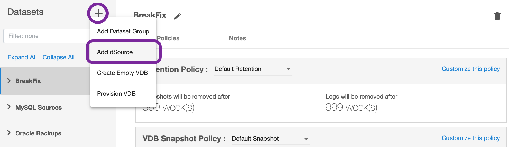

# Manual Ingestion

In Manual Ingestion Mode, Delphix creates a seed (empty) staging database. 
Customer users will be responsible to manually ingest data into this staging db. 
All other management operations can be performed through Delphix. A snapshot can be taken either manually 
or via a SnapSync policy once the data is restored into the seed staging database. 

### Pre-Requisites

- Staging environment must be added to Delphix.
- A Source Config must be created on the staging environment-MySQL repository.
- [Recommended] 
  As every  organization's MySQL configuration is different,
  Delphix expects a starter *my.cnf* file to be present in Delphix Toolkit Directory when creating a staging database.
  Delphix will use this *my.cnf* file and modify it as per the configuration provided during the the dsource creation process.

  This is recommended to reduce the possibility of errors while restoring the backup from the source database.

  !!! warning
  It may take upto 5 minutes after successful dSource creation for the status to show as Active.

### Creating dSource

1. Login to **Delphix Management** application.
2. Click **Manage** >  **Datasets**.
3. Select **Add dSource**.

   

4. In the Add dSource wizard, select the MySQL source configuration which is created on the staging host.
5. Select *Manual Ingestion* in the dSource Type dropdown.
6. Provide the additional details required for dsource creation
  - Staging DB Server ID

    Server ID for the dsource (stagind db. For Replication Mode,
    this server id must be greater than the source db server id.

  - Staging DB Port

    Port for the dsource (staging db).

  - Staging Initialization Password

    Password to use while initializing the dsource (staging db).
    This password will be assigned to the *'root'@'localhost'*

  - MySQL Base Directory

    MySQL installation directory. This is where the location of */bin/mysql*

  - Mount Location on Staging Host

    This is the mount directory for Delphix on the staging host. 
    This location should be unique and empty.

  - Source DB UserName

    Delphix db user on the source database. In Manual Ingestion mode, Delphix does not connect to the source db.
    Delphix will be using this db user to manage the dsource and other time travel operations.
    This user must be part of the source db backup that will be restored into the staging db.

  - Source DB Password

    Password for the source db user.

8. On dSource Configuration screen, select the dataset group where the dSource will be placed and click *Next*.
9. On the Data Management screen, select the staging environment and the environment user and click *Next*.
10. On the Policies screen, select the Snapsync and Retention policies for the dSource and click *Next*.
11. On the Hooks screen, add any pre-sync and (or) post-sync hooks as required and click *Next*.
12. Review the dSource configuration on the Summary screen and Submit. The Linking process has commenced.

    

Once the dSource creation is successful, the *Timeflow* tab should show the initial snapshot.

Done, What's Next?
----------------
Alright, we have created a MySQL dSource. Next step - Provision a VDB.   

