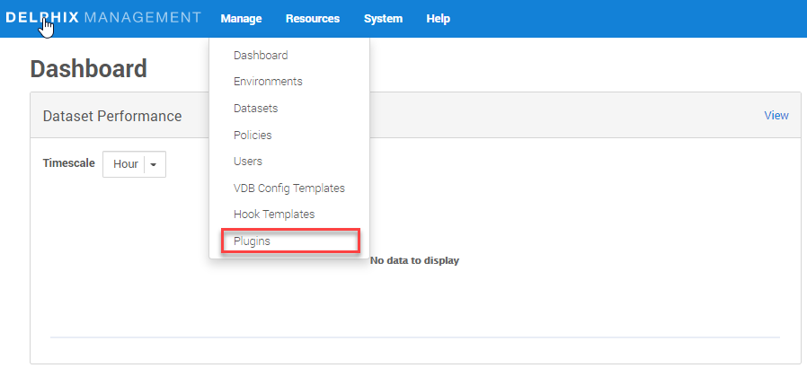
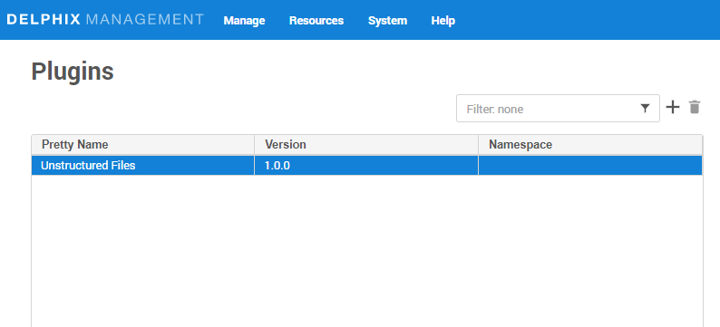
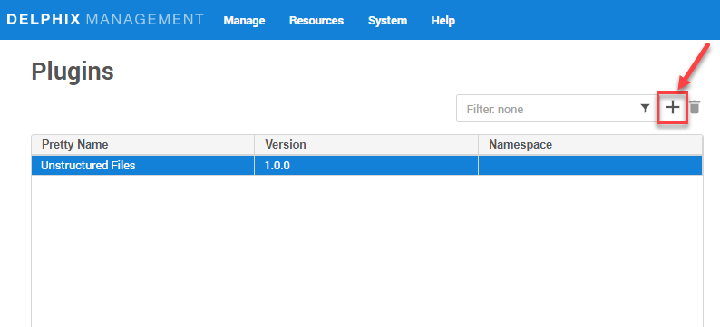
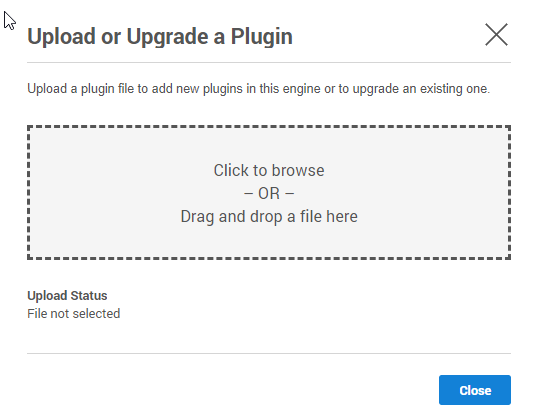

# Plugin Installation

## Prerequisites

-   Delphix Engine of version 6.0.x
-   Install MySQL Binaries on source, staging, and target servers

## Installing the MySQL Plugin

### Method1: Using GUI

1. Click on **Manage** (present on top-left of this page) and then **Plugins**.  
   
      

2. Click on **+** icon.  
   
      

3. Click on **Upload** a plugin.  
   
      

4. Select the `build(artifacts.json)` from your device.   
   
      

5. Click on **close** button.  
   
      

6. See the plugin version in **Plugins** section.  
   
      

### Method2: Using dvp command

`dvp upload -e <Delphix_Engine_Name> -u <username> --password <password>`

Delphix Engine's documentation on installing plugins: 
[PluginManagement](https://docs.delphix.com/docs/datasets/unstructured-files-and-app-data/delphix-engine-plugin-management).