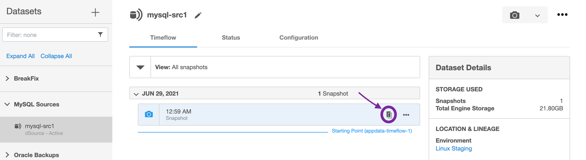
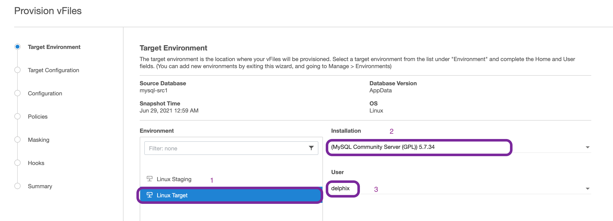
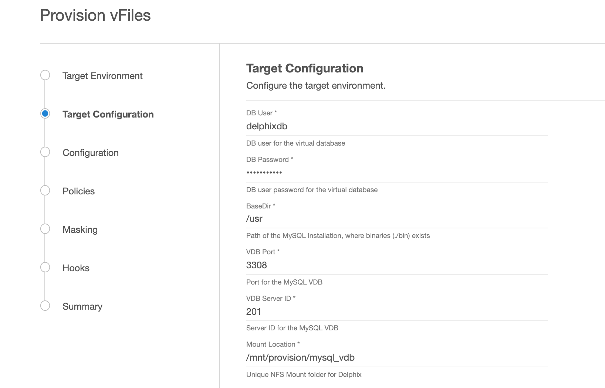
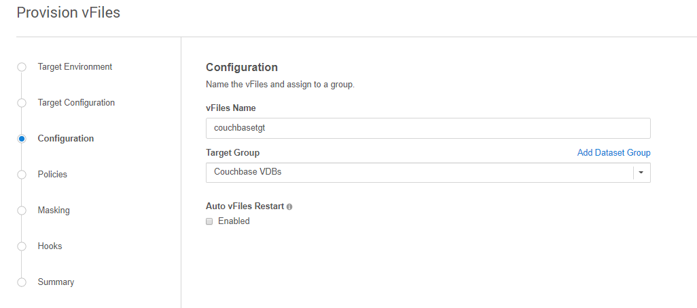

# Provisioning

Virtual Databases (VDB) are a virtualized copies of dSource. 
A VDB can be created using a snapshot on the dSource timeflow. 

## Prerequisites

- Require a linked dSource with at least 1 snapshot.
- Require a Target environment added to Delphix.
- A MySQL binary with the same version as the source db must be installed on the Target enviornment.
  
    !!! warning
        It may take upto 5 minutes after successful dSource creation for the status to show as Active.

## Provisioning a VDB

1. On the dSource Timeflow, click on the *Provision* action 
   on the snapshot that you want to use for the VDB (highlighted below) 
   
      

2. Select the target host from the dropdown on which VDB needs to be created.  
   If there are multiple MySQL repositories on the host, 
   select the one that matches the source db version.
   
    If there are multiple OS users on the host, select the user you want to use. 
   
      

3. Enter the following values for the target configuration:
      - DB User
         This is the database user for the VDB. Delphix will use this user to manage the VDB.
         It is recommended that you use the same user account that was used by the staging db.
        
      - DB Password
         Password for the VDB db user. 
   
      - BaseDir
         MySQL installation directory. This is where the location of */bin/mysql*
   
      - VDB Port
         MySQL database port for the VDB.
   
      - VDB Server ID
         MySQL server id for the VDB. This server id must be non-zero and greater than the dsource server id.
        
      - Mount Location
         This is the mount directory for Delphix VDB on the Target host.
         This location should be unique and empty.
 
      

4. On Configuration screen, add VDB name, select Target group,  check *Auto vFiles Restart* checkbox and select **Next**
   

5. On Policies screen, add any required policies and select **Next**.

6. If you want to Mask the VDB, select the required configuration this screen and select **Next**.

7. On Hooks screen, add any required Hooks and select **Next**.

8. Preview the summary and select **Submit**.

9. Once the VDB is created successfully, you can review the datasets on **Manage** > **Datasets** > **vdb Name**.

And we're done!
----------------
We have now successfully provisioned a MySQL VDB. 